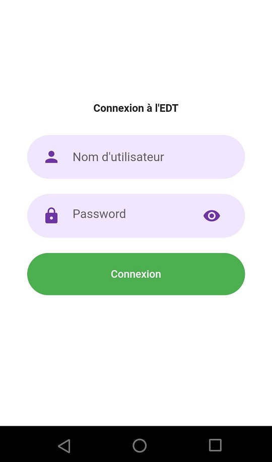
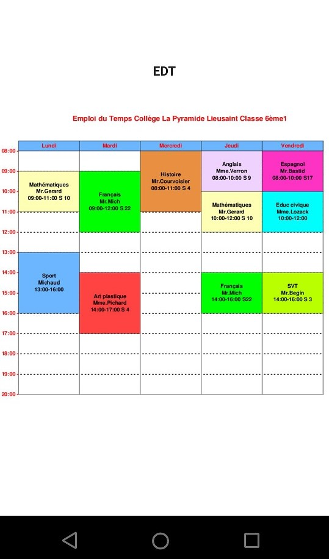

# Fluuter_Ui

Voici a quoi ressemble l'application sur mobile : 

Page d'Accueil  

 

 
  

 Page de Connexion 
 
 

 Page d'inscription des Enseignants 
 
 
 
 
 Page d'inscription des Etudiants 
 
 
 
 
  Page de consulatation de l'Emploi Du Temps 
 
 
